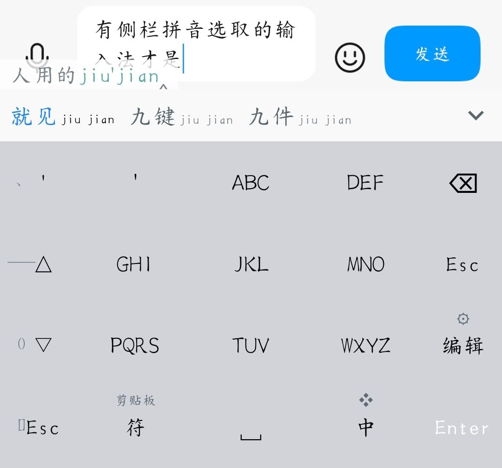
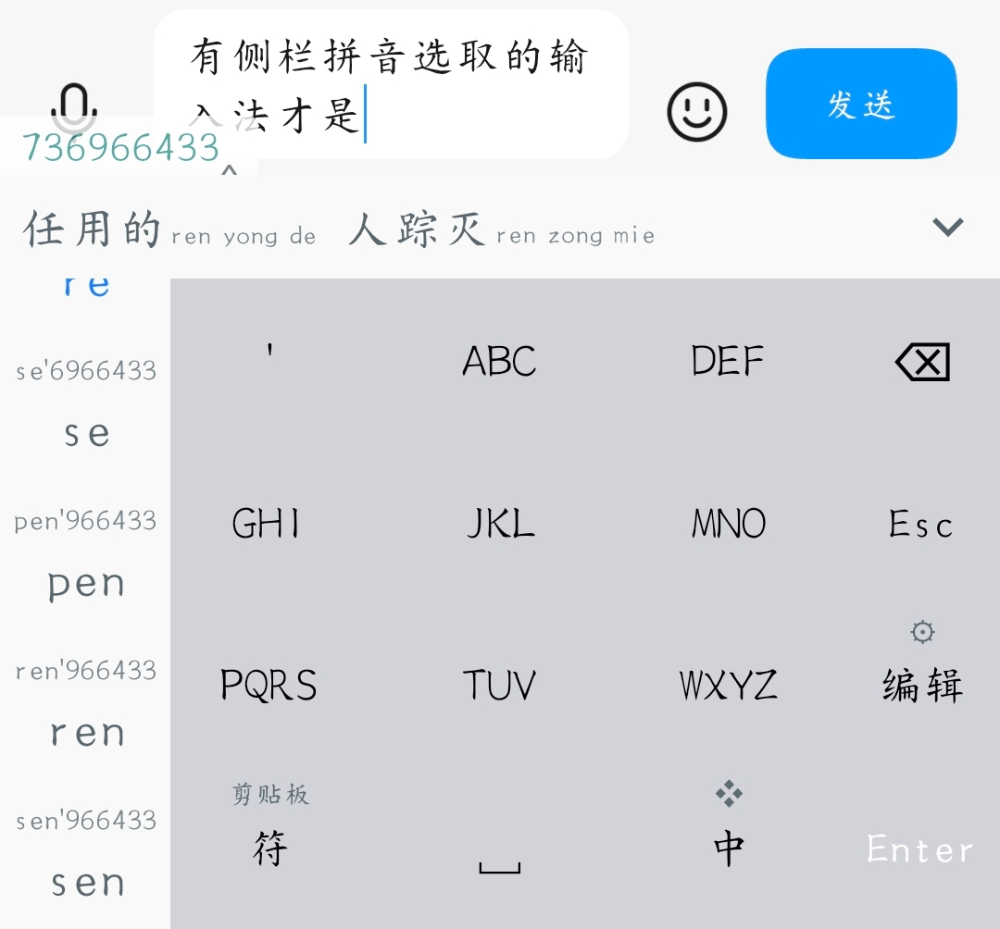

# 九宫拾音 rime-t9-shiyin

给 **同文输入法（Trime）+ 雾凇拼音九宫格** 带来商业输入法级体验的开源增强包。

核心目标：把百度输入法（小米版）九宫格上那些"用了就回不去"的交互，在开源 Rime 生态里复现。

<p>
  
  
</p>

> 真机实拍（同文·拾音 fork）：九宫格输数字串，左侧竖栏逐字选音节（可滚动翻更多），候选条只留词。
> 图中正在输入「有侧栏拼音选取的输入法才是人用的九键」。

## 下载

开箱即用请看 **[同文·拾音 v0.1.0 Release](https://github.com/Koishi-Neko/trime/releases/tag/v0.1.0)**：
APK（侧栏版输入法 App）+ 配置包 zip 都在那里，安装与部署说明见 Release 页。

## 功能

| 功能 | 状态 | 说明 |
|---|---|---|
| **音节筛选**（拾音） | ✅ 已移植进 t9 方案（引擎层回归通过 + 真机验收，[剩余 Trime 侧确认项](schema/PORTING.md#8-trimeandroid侧待验证清单)） | 九宫格数字串 → 列出所有合法拼音切分（如 `94343` → `zhe`/`xie`/`zhei`…），**点完一个音节继续给剩余数字的音节候选**（`zhe` → `zhe'43` → `ge` → `zhe'ge`），全程零提交，点词才上屏。Rime 系九宫格长期缺失的能力，由 librime-lua 实现 |
| 删除键上滑清空 | ✅ | `swipe_up: Clear`（全选删除），原有左滑清空保留 |
| **音节侧栏**（同文·拾音 fork） | ✅ 真机验收通过 | Trime fork（包名 `com.osfans.trime.shiyin`，与官方共存）把音节候选从横向候选条抽进**左侧竖栏**：叠加覆盖符号列、键盘零位移、可滚动、逐字连续选；设置→候选窗口可开关。源码：[Koishi-Neko/trime](https://github.com/Koishi-Neko/trime)（默认分支 `shiyin-sidebar`），构建说明见仓库根 `SIDEBAR.md` |
| **符号滚动侧栏**（同文·拾音 fork） | ✅ 真机验收通过 | 同一竖栏在空闲时显示 8 个标点`，。？！、——（）【】`（滚动直点上屏，替代原左列单击+长按 4+4）；数字键盘自动换成 `+ - * / = _ （）【】`；组字中与 26 键键盘自动隐藏。设置→候选窗口「符号侧栏」独立开关。fork commit `1280ce9` + `85ee8b4`（修英文 26 键误判） |
| 空码标点侧栏 | ✅（主题层，被符号滚动侧栏叠加覆盖） | 键盘左列高频标点，输入中自动变为分词/翻页等功能，滑动扩展更多符号 |
| 数字键盘符号栏 | ✅ | 数字布局左列 `+ - * /` 等符号 |
| 分类符号面板 | ✅ | liquid keyboard 精简重排：常用(最近) / 中文 / 英文 / 数学 / 表情优先，左侧分类 + 右侧网格 |

## 原理

音节筛选不依赖任何引擎补丁，纯 librime-lua 实现：

1. `lua_translator` 对「末尾还有待切分数字」的输入用「全拼合法音节前缀树」DFS 枚举读法，
   把可选首音节产出为候选（text = 音节如 `zhe`，comment = 短读法如 `zhe'43`）
2. `lua_filter` 把音节候选的跨度缩到「本次消费的数字末尾」，让引擎按 partial 选择处理（点选永不提交）
3. 点选后经 `select_notifier` 扫描 composition 还原被点中的音节，
   把 `context.input` 从 `94343` 改写为 `zhe'43`；剩余数字继续出音节候选（连续逐字选音节）
4. 引擎原生接力：字母按精确拼音、剩余数字继续 T9，全部定完或随时点词候选上屏

完整技术验证（含真实转录与 11 条踩坑）见 [docs/syllable-prototype-report.md](docs/syllable-prototype-report.md)。
为什么移植时**没有**照原型改用 `fluid_editor`、音节候选怎么改 text 渲染、emoji 变体与
「文本框里出现 343」的排查结论，见 [schema/PORTING.md](schema/PORTING.md)。

## 目录

```
schema/t9.schema.yaml   雾凇九宫格 t9 方案（原包文件 + 5 处移植改动，可直接覆盖）
schema/PORTING.md       移植说明：改了哪些行、为什么、真机验收后的调整、Trime 侧待验证清单
schema/rime_ice.dict.yaml   包内挂载表（原包文件 + `- circled_digits` 一行）
schema/circled_digits.dict.yaml  带圈数字 ⓪①②…⑳ + keycap 0️⃣-9️⃣🔟（权重已对调；**桌面小狼毫与手机共用这一份源文件**）
opencc/emoji.txt        手机包 opencc/emoji.txt 的副本，摘掉 11 行 keycap 派生（`零	零 0️⃣`…`十	十 🔟`）
lua/t9_syllable*.lua    挂进手机包 lua/ 目录的四个 lua（translator / processor / filter / core）
tools/harness.py        ctypes 直调 rime.dll 的无头测试底座（来自原型工程）
tools/harness_real.py   用真实手机包 + 真实 rime_ice 词典跑回归（base/port 对照）
tools/push_incremental.ps1  增量推送到手机 pinyin/（主题/方案/词库/opencc/lua 共 9 个文件）
docs/                   原型验证报告
```

## 使用

把 `lua/t9_syllable*.lua` 拷进手机包（或 Trime 配置目录）的 `lua/` 下，
`schema/t9.schema.yaml` 覆盖包根目录的同名文件，然后重新部署即可。

引擎层回归（需要本机装了小狼毫，脚本用它的 `rime.dll`；全程不碰 `%APPDATA%\Rime`）：

```bash
python tools/harness_real.py all --variant port                # 移植后（默认 text 渲染模式）
python tools/harness_real.py all --variant port --mode empty   # 空 text 备选模式
python tools/harness_real.py all --variant base                # 原包基线（同一条命令，便于逐行对照）
```

沙箱与编译产物默认落在原型工程的 `../rime-lexicon/t9-syllable-prototype/out/realtest/`，
转录写到该工程的 `transcripts/`；路径可用 `T9_WORKSPACE` / `T9_PKG` / `T9_TRANSCRIPTS` 覆盖。
注意对照要在 deploy 之后的第一次 run 里看：同一沙箱重复 run 会被用户词典学习影响候选顺序。

## 致谢与许可

- 主题基底：[同文风·增强版](https://github.com/SivanLaai/rime-pure) by SivanLaai（MIT License）
- 输入方案基底：[雾凇拼音 rime-ice](https://github.com/iDvel/rime-ice) by iDvel 及贡献者（GPL-3.0）
- 本项目整体以 [GPL-3.0](LICENSE) 发布
